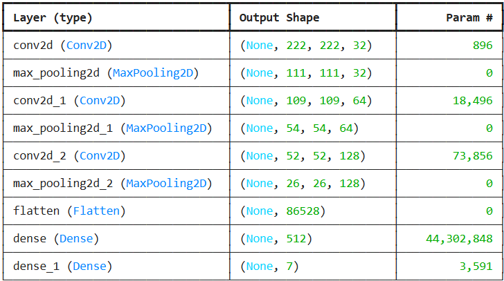
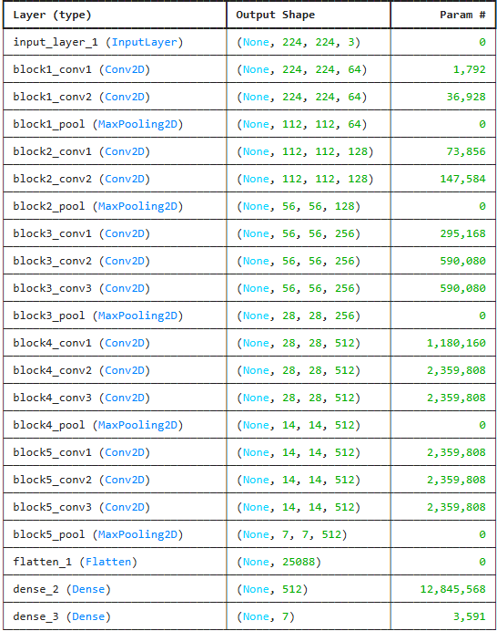
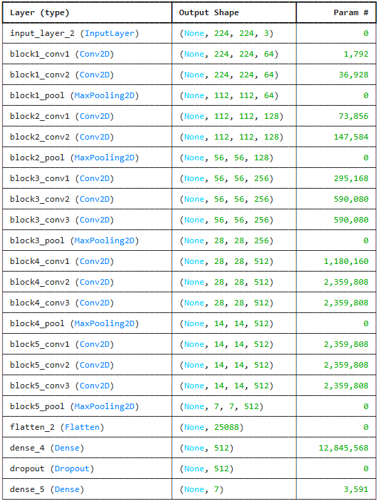
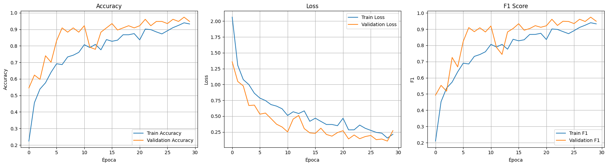
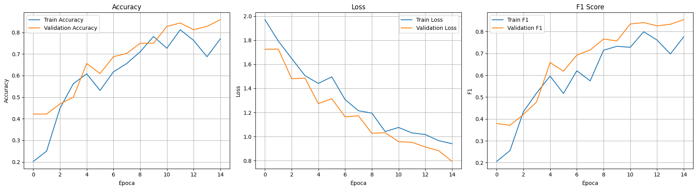
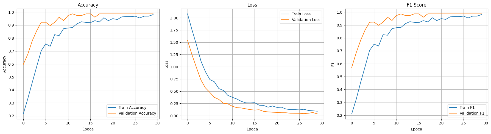
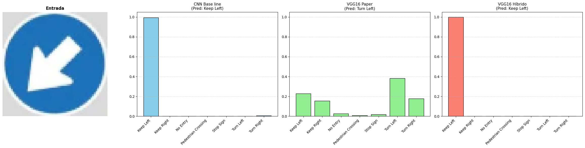
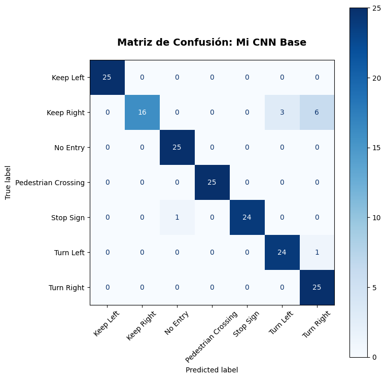
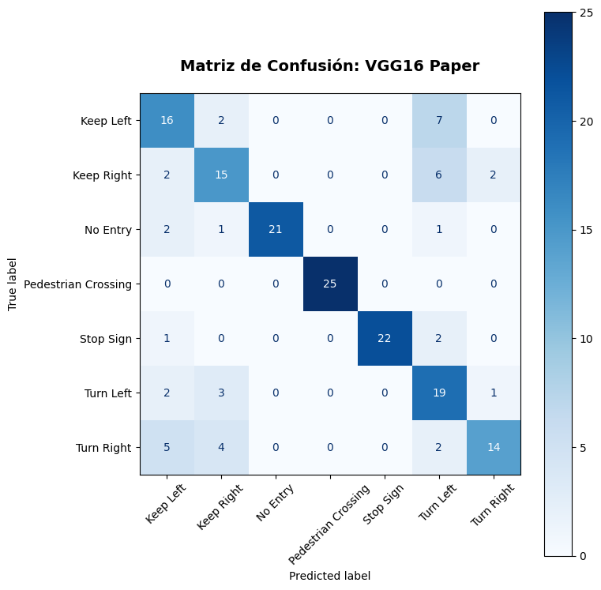
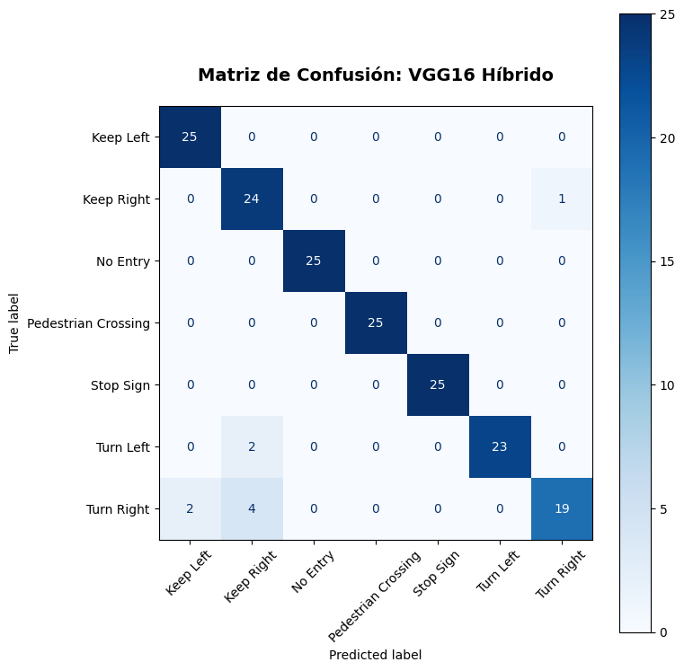

# DAACC_IA

# Clasificación de Señales de Tráfico Mediante Redes Neuronales Convolucionales

Proyecto de **clasificación multiclase** de señales de tránsito utilizando Redes Neuronales Convolucionales (CNN).

---

# Resumen 

Este proyecto presenta un enfoque basado en Redes Neuronales Convolucionales (CNN) para la clasificación de señales viales en siete categorías: 
- Keep Left
- Keep Right
- No Entry
- Pedestrian Crossing
- Stop Sign
- Turn Left
- Turn Right

Así mismo se proporciona una interfaz web interactiva para la evaluación de imágenes en tiempo real con visualización de probabilidades, habilitada directamente dentro de notebooks de Google Colaboratory. Los resultados experimentales demuestran un rendimiento de clasificación efectivo sobre el conjunto de datos personalizado de señales viales.

Palabras clave: Clasificación de señales viales · Redes neuronales convolucionales · Aprendizaje por transferencia · Clasificación de imágenes · Vehículos autónomos · Google Colab · Kaggle

---

# Estructura del Proyecto en kaggle y Google Colab

```bash
Road_Signals/
├── kaggle/
    ├── input/
        ├── datasets/
            ├── ziadghanem01/
                ├── road-signs/
                    ├── dataset/  # Dataset original
├── all_signals/                  # Dataset combinado
├── signals/                      # Dataset 
```

# Estructura del Proyecto

```bash
DAACC_IA/
├── Road_Signals.ipynb            # Notebook principal — entrenamiento y evaluación
├── Interfaz_road_signals.ipynb   # Notebook para prueba de interfaz interactiva
├── results/                      # Imágenes de resultados y métricas
│   ├── .png
│   ├── .png
│   └── .png
├── models/                       # Modelos guardados
│   └── road_signals_model_hybrid.h5
│   └── road_signals_model_paper.h5
│   └── road_signals_model.h5
└── README.md
```

---

# Tecnologías Utilizadas

- **Lenguaje:** Python 3.12
- **Framework:** TensorFlow / Keras
- **Modelo:** CNN convolucional desde cero (3 bloques Conv2D + MaxPooling)
- **Data Augmentation:** `ImageDataGenerator`
- **Entorno:** Kaggle Notebook (GPU Tesla P100)
- **Visualización:** Matplotlib

---

# Dataset

El conjunto de datos utilizado en este proyecto consiste en imágenes pertenecientes a siete clases de señales viales:

| Clase          | Cantidad Original | Porcentaje |
|----------------|-------------------|------------|
| Keep Right     | 667               | 22.5%    |
| Turn Right     | 552               | 18.6%    |
| No Entry       | 634               | 21.4%    |
| Turn Left      | 443               | 14.9%    |
| Keep Left      | 303               | 10.2%    |
| Pedestrian Crossing  | 251               | 8.5%     |
| Stop Sign      | 119               | 4.0%     |

**Imágenes totales:** 2,969

**Fuente:** [Road Signs Dataset](https://www.kaggle.com/datasets/ziadghanem01/road-signs)

---

# Preprocesamiento

- **Redimensionamiento:** Todas las imágenes redimensionadas a 224 × 224 píxeles para coincidir con la forma de entrada del modelo.

- **Normalización:** Valores de píxeles escalados al rango [0, 1] dividiendo entre 255.

- **Aumento de datos (Data Augmentation):** Aplicado únicamente al conjunto de entrenamiento para incrementar la variabilidad de los datos y reducir el sobreajuste:
  - Desplazamiento horizontal aleatorio de hasta un 20% (`width_shift_range=0.2`).
  - Desplazamiento vertical aleatorio de hasta un 20% (`height_shift_range=0.2`).
  - Transformación de cizallamiento (*shear*) de hasta un 20% (`shear_range=0.2`).
  - Zoom aleatorio de hasta un 20% (`zoom_range=0.2`).
  - No se aplicó volteo horizontal (`horizontal_flip=False`), ya que podría alterar el significado de algunas señales de tránsito.

- **Estrategia de balanceo:** Todas las clases reducidas a **119 imágenes** (para evitar sesgo del modelo)

- **División final:**
  - Train: 70%
  - Validation: 10%
  - Test: 20%

---

# Metodología

1. **Combinación de datos**: Se unieron las carpetas `train` y `val` en una sola carpeta (`all_signals`).
2. **Balanceo de clases**: Todas las clases fueron igualadas a 119 imágenes, con el fin de evitar el "sesgo del modelo", ya que el modelo puede aprende mucho mejor la clase que tiene más imagenes.
3. **Data Augmentation**: Rotación, desplazamiento, deformación y zoom.
4. Se implementaron tres modelos de forma reproducible.
    - CNN Base - Arquitectura desde 0
    - Reproducción de la CNN del paper
    - Modelo mejorado con Transfer Learning

## CNN Base - Arquitectura desde 0

La arquitectura CNN propuesta sigue un diseño secuencial con tres bloques convolucionales, cada uno compuesto por una capa de convolución seguida de max pooling, seguidos de capas completamente conectadas para la clasificación.
 
```
Entrada (224 × 224 × 3)
    │
    ├─ Conv2D(32, 3×3, ReLU) → MaxPooling2D(2×2)
    ├─ Conv2D(64, 3×3, ReLU) → MaxPooling2D(2×2)
    ├─ Conv2D(128, 3×3, ReLU) → MaxPooling2D(2×2)
    │
    ├─ Flatten
    ├─ Dense(512, ReLU)
    └─ Dense(7, Softmax)
 
Salida: Distribución de probabilidad sobre 7 clases
```

### Descripción de la arquitectura



**Configuración**:
    - **Optimizador:** Adam.
    - **Función de Pérdida:** Entropía cruzada categórica (`categorical_crossentropy`), adecuada para la clasificación multiclase con etiquetas en codificación *one-hot*.
    - **Métricas:** Accuracy y F1 score.
    - **Flujo de Entrenamiento:** El proceso se extendió por un máximo de 30 épocas utilizando generadores de datos en lotes (*data streams*). Con el fin de regularizar y estructurar los ciclos de cómputo, se fijaron 100 pasos por época (`steps_per_epoch=100`) para el subconjunto de entrenamiento y 50 pasos para el subconjunto de validación (`validation_steps=50`).

## Reproducción de la CNN del paper

Se implementó de forma estricta la metodología expuesta por Hosseini et al. (2023) [1]. El estudio original demuestra que al utilizar arquitecturas masivas preentrenadas con millones de imágenes genéricas (ImageNet), se logran tasas de éxito superiores al 99% en el dataset alemán GTSRB.

En el documento `Road Sign Classification Using Transfer Learning and Pre-trained CNN Models` no se construyo una red neuronal desde cero. En su lugar, utiliza una técnica llamada Transfer Learning (Aprendizaje por Transferencia). El cual consiste en tomar arquitecturas de modelos muy profundos que ya fueron pre-entrenados con millones de imágenes y adaptarlos a un nuevo problema (en este caso, las señales de la carretera). Los autores evaluaron 4 arquitecturas: VGG-16, VGG-19, ResNet50 y EfficientNetB0. Según sus resultados (Tabla 1 del documento `Performance Metrics of Road Sign Classification Models`), el modelo que mejor desempeño tuvo fue VGG-16, alcanzando un 99.21% de accuracy y un 99.11 de F1-score. Las configuraciones exactas que usaron los autores son: 
- Cargar el modelo pre-entrenado y congelar sus capas, asu vez, estas las utilizaron como extractores de características para la clasificación de señales de tráfico.
- Al final añadieron una ultima capa (una capa densa) conectada al modelo preentrenado, que toma las características extraídas como entrada y genera la distribución de probabilidad sobre las 43 clases de señales de tráfico.
- Hiperparámetros:
    - Optimizador: Adam
    - Tasa de aprendizaje (Learning Rate): $1e^{-5}$
    - Tamaño de lote (Batch size): 32 
    - Épocas: 15
    - Detención temprana (Early Stopping): Paciencia de 3 épocas si la validación no mejora.

```
Entrada (224 × 224 × 3)
    │
    ├─ VGG16 Base (ImageNet, capas congeladas)
    │
    ├─ Flatten
    ├─ Dense(512, ReLU)
    └─ Dense(7, Softmax)

Salida: Distribución de probabilidad sobre 7 clases
```

### Descripción de la arquitectura



> [!IMPORTANT]
> En el paper usaron el dataset: GTSRB, el cual tiene 43 clases y son señales alemanas.

## Modelo mejorado con Transfer Learning

La arquitectura híbrida propuesta combina Transfer Learning y Fine-Tuning utilizando la red preentrenada VGG16 como extractor de características. Los primeros cuatro bloques convolucionales permanecen congelados para conservar el conocimiento adquirido durante el entrenamiento sobre ImageNet, mientras que el último bloque convolucional es ajustado específicamente para la tarea de clasificación de señales de tránsito. Posteriormente, se añaden capas densas personalizadas para realizar la clasificación final.

### Configuración

**Modelo Base**: VGG16 preentrenada con pesos de ImageNet (`include_top=False`).
**Estrategia de Entrenamiento**: Fine-Tuning parcial, descongelando únicamente el último bloque convolucional de VGG16 mientras los bloques restantes permanecen congelados.
**Regularización**: Capa `Dropout(0.5)` para reducir el sobreajuste y mejorar la capacidad de generalización.
**Optimizador**: `Adam` con tasa de aprendizaje de `1e-5`.
**Función de Pérdida**: Entropía cruzada categórica (`categorical_crossentropy`), adecuada para problemas de clasificación multiclase con etiquetas codificadas en formato one-hot.
**Métricas**: Accuracy y F1-Score.
**Flujo de Entrenamiento**: El proceso se ejecutó durante un máximo de 30 épocas utilizando generadores de imágenes por lotes. Se configuraron 100 pasos por época (`steps_per_epoch=100`) para el conjunto de entrenamiento y 50 pasos para el conjunto de validación (`validation_steps=50`).

```
Entrada (224 × 224 × 3)
    │
    ├─ VGG16 Preentrenada (ImageNet)
    │   ├─ Bloques 1–4 congelados
    │   └─ Bloque 5 ajustable (Fine-Tuning)
    │
    ├─ Flatten
    ├─ Dense(512, ReLU)
    ├─ Dropout(0.5)
    └─ Dense(7, Softmax)

Salida: Distribución de probabilidad sobre 7 clases
```

### Descripción de la arquitectura



Al permitir que el último bloque de convoluciones ajuste sus pesos frente a una tasa de aprendizaje pequeña (`$1e^{-5}$`), los filtros abstractos se adaptan a las formas de las señales del dataset objetivo (flechas, octágonos, bordes triangulares), mientras que la capa de `Dropout(0.5)` previene la co-adaptación de neuronas, eliminando de raíz el sobreajuste latente que sufren los modelos sobreparametrizados.


> [!NOTE]
> Estos modelos se encuentran en el archivo: `Road_Signal.ipynb`.

---

# Resultados

Siguiendo las recomendaciones internacionales del estado del arte (Hosseini et al., 2023), los modelos fueron evaluados utilizando Accuracy y F1-Score, métrica esencial para le uso de clases.

## CNN Base - Arquitectura desde 0

**Mejores métricas obtenidas:**
| Conjunto                |F1 Score|Accuracy | Loss  |
|-------------------------|--------|---------|------|
|**Train** (Epoca 29)     | 0.9395 |  0.9398 | 0.1548  |
|**Validation** (Epoca 29)| 0.9740 |  0.9740 | 0.1073  |
|**Test**                 | 0.9344 |  0.9371  | 0.1900  |

### Gráficas de Entrenamiento



## Reproducción de la CNN del paper

**Mejores metricas obtenidas:**
| Conjunto                |F1 Score|Accuracy | Loss  |
|-------------------------|--------|---------|------|
|**Train** (Epoca 12)     | 0.7992 |  0.8125 | 1.0305  |
|**Validation** (Epoca 15)| 0.8548 |  0.8594 | 0.7934  |
|**Test**                 | 0.7618 |  0.7543  | 0.8422  |

### Gráficas de Entrenamiento



## Modelo mejorado con Transfer Learning

**Mejores metricas obtenidas:**
| Conjunto                |F1 Score|Accuracy | Loss  |
|-------------------------|--------|---------|------|
|**Train** (Epoca 30)     | 0.9811 |  0.9811 | 0.0919 |
|**Validation** (Epoca 29 y 30)| 0.9870 |  0.9870 | 0.0372  |
|**Test**                 | 0.9481 |  0.9486  | 0.0956  |

### Gráficas de Entrenamiento



## Resultados finales

| Modelo              | Test Acc | Test F1-Score |
|---------------------|----------|---------------|
| CNN Baseline        | 0.9371   | 0.9344        |
| VGG16 (Paper)       | 0.7543   | 0.7618        |
| VGG16 (Híbrido)     | 0.9486   | 0.9481        |

### CNN Baseline
Test Accuracy (0.9371): Al enfrentarse al set de prueba con imágenes del mundo real que jamás había visto, el modelo clasifica correctamente el 93.71% de las señales de tráfico.

Test F1-Score (0.9344): Indica un excelente equilibrio (93.44%) entre la precisión (no confundir una señal con otra, como Turn Left con Keep Left) y la sensibilidad (detectar la mayor cantidad de señales reales de cada tipo). El modelo es altamente confiable y balanceado entre las 7 clases.

### VGG16 (Paper) 
Test Accuracy (0.7543): Al evaluar con imágenes completamente nuevas de prueba, su rendimiento cae drásticamente. El modelo clasifica correctamente solo el 75.43% de las señales; es decir, falla en 1 de cada 4 señales de tráfico.

Test F1-Score (0.7618): Un valor deficiente (76.18%). Significa que el modelo pierde el equilibrio en varias clases: genera muchas falsas alarmas (confunde formas geométricas similares) o pasa por alto señales reales debido a que los filtros heredados de ImageNet están congelados y no reconocen bien este dominio.

### Híbrido

Test Accuracy (0.9486): Al enfrentarse al set de prueba con imágenes del mundo real que jamás había visto, el modelo clasifica correctamente el 94.86% de las señales de tráfico, convirtiéndose en el modelo más exacto de todo el experimento.

Test F1-Score (0.9481): Un puntaje sobresaliente (94.81%). Certifica que el refinamiento (Fine-Tuning + Dropout) logró un equilibrio óptimo: el sistema es sumamente robusto contra falsos positivos (no inventa señales que no están ahí) y falsos negativos (no se le escapa casi ninguna señal de las 7 categorías).

### Prueba con imagen



Los resultados mostrados nos indican cómo actúan los tres modelos frente a una imagen sacada de internet.

### ¿Por qué la replicación del paper tiene un 75.43% de exactitud?
La literatura base de Hosseini et al. utiliza VGG16 congelada de forma exitosa debido a que entrenan sobre el dataset alemán GTSRB, el cual posee más de 50,000 imágenes. Al aplicar esa misma metodología restrictiva sobre un dataset balanceado pequeño (833 imágenes), el modelo sufre un resultado con ruido no logrando mapear las clases simples de manera correcta. 


## Matriz de confusión

### CNN Base - Arquitectura desde 0



### Reproducción de la CNN del paper 



### Modelo mejorado con Transfer Learning



Las confusiones masivas entre las flechas direccionales colapsaron a su punto mínimo: 
- Clase 5 (Turn Left) con Clase 0 (Keep Left) existen errores de confusión, al igual que con las clases Clase 6 (Turn right) y  Clase 1 (Keep right).

Clases complejas como 2 (No Entry), 4 (Stop Sign) y 0 (Keep Left) obtuvieron un 100% de efectividad (24/24 aciertos).

---

## Cómo Ejecutar el Proyecto

1. Clonar el repositorio:
   ```bash
   git clone 
   cd DAACC_IA
    ```
2. Ir al link de colab:
   ```bash
   https://drive.google.com/file/d/1WnmyhfcQ-aAz_27V_5awFO6Y8Tl_CP8R/view?usp=sharing
    ```


## Referencias
[1]
‌Hosseini, S.H., Ghaderi, F., Moshiri, B., Norouzi, M. (2023). Road Sign Classification Using Transfer Learning and Pre-trained CNN Models.