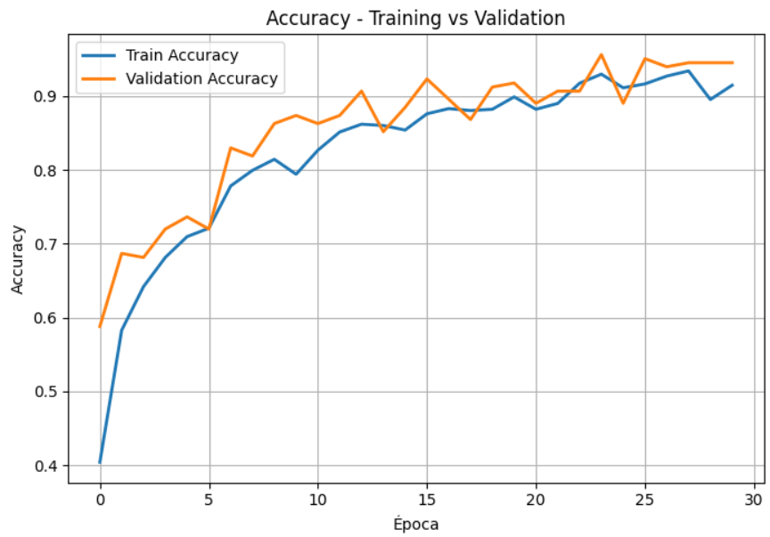
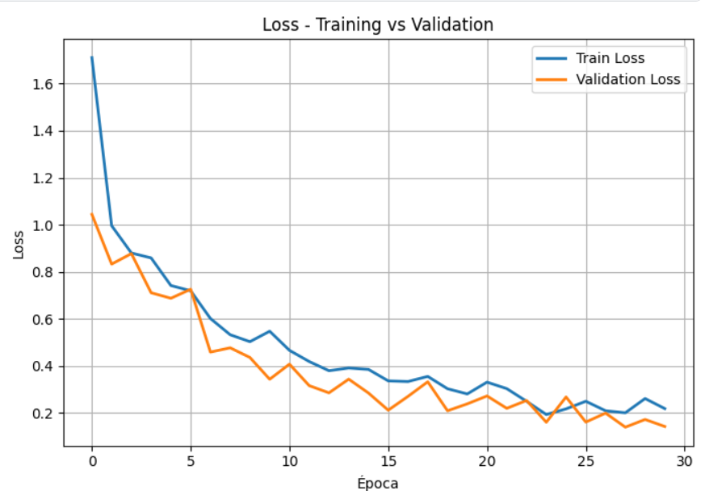

# DAACC_IA

# Clasificación de Señales de Tráfico

Proyecto de **clasificación multiclase** de señales de tránsito utilizando Redes Neuronales Convolucionales (CNN).

---

## Descripción del Proyecto

Este proyecto tiene como objetivo desarrollar un modelo capaz de identificar correctamente **7 tipos de señales de tráfico** comunes. Se utilizó un enfoque de aprendizaje profundo con TensorFlow/Keras, partiendo de un modelo CNN creado desde cero y aplicando técnicas de preprocesamiento y data augmentation.

**Precisión alcanzada en Test:** **95.32%**

---

## Tecnologías Utilizadas

- **Lenguaje:** Python 3.12
- **Framework:** TensorFlow / Keras
- **Modelo:** CNN convolucional desde cero (3 bloques Conv2D + MaxPooling)
- **Data Augmentation:** `ImageDataGenerator`
- **Entorno:** Kaggle Notebook (GPU Tesla P100)
- **Visualización:** Matplotlib

---

## Dataset

- **Fuente:** [Road Signs Dataset](https://www.kaggle.com/datasets/ziadghanem01/road-signs)
- **Número de clases:** 7
  - Keep Left
  - Keep Right
  - No Entry
  - Pedestrian Crossing
  - Stop Sign
  - Turn Left
  - Turn Right

- **Imágenes totales combinadas:** 2,969
- **Estrategia de balanceo:** Todas las clases reducidas a **119 imágenes** (para evitar sesgo del modelo)

- **División final:**
  - Train: 70%
  - Validation: 10%
  - Test: 20%

---

## Metodología

1. **Combinación de datos**: Se unieron las carpetas `train` y `val` en una sola carpeta (`all_signals`).
2. **Balanceo de clases**: Todas las clases fueron igualadas a 119 imágenes, con el fin de evitar el "sesgo del modelo", ya que el modelo puede aprende mucho mejor la clase que tiene más imagenes.
3. **Data Augmentation**: Rotación, desplazamiento, deformación, zoom y flip horizontal.
4. **Modelo**: CNN con dos fases extracción de cartacteristicas y clasificación densa.
6. **Configuración**:
    - **Optimizador:** Adam.
    - **Función de Pérdida:** Entropía cruzada categórica (`categorical_crossentropy`), adecuada para la clasificación multiclase con etiquetas en codificación *one-hot*.
    - **Métrica Principal:** Precisión (*Accuracy*).
    - **Flujo de Entrenamiento:** El proceso se extendió por un máximo de 30 épocas utilizando generadores de datos en lotes (*data streams*). Con el fin de regularizar y estructurar los ciclos de cómputo, se fijaron 100 pasos por época (`steps_per_epoch=100`) para el subconjunto de entrenamiento y 50 pasos para el subconjunto de validación (`validation_steps=50`).
7. **Enfoque Comparativo**: Aprendizaje por Transferencia (modelo del documenot `Road Sign Classification Using Transfer Learning and Pre-trained CNN Models`)

---

## Resultados
**Mejor Accuracy obtenida:**
| Conjunto                  | Accuracy | Loss   |
|---------------------------|----------|--------|
| **Train** (Epoca 28)      |   93.40  | 20.05  |
| **Validation** (Epoca 24) |   95.60  | 16.04  |
| **Test**                  |   95.32  | 14.34  |


### Gráficas de Entrenamiento




---

## Estructura del Proyecto en kaggle y Google Colab

```bash
Road_Signals/
├── kaggle/
    ├── input/
        ├── datasets/
            ├── ziadghanem01/
                ├── road-signs/
                    ├── dataset/  # Dataset original
├── all_signals/                  # Dataset combinado
├── signals/                      # Dataset 
```

## Estructura del Proyecto

```bash
DAACC_IA/
├── Road_Signals.ipynb            # Notebook principal
├── results/
├── README.md
```

---

## Cómo Ejecutar el Proyecto

1. Clonar el repositorio:
   ```bash
   git clone 
   cd DAACC_IA
    ```
2. Ir al link de colab:
   ```bash
   https://drive.google.com/file/d/1WnmyhfcQ-aAz_27V_5awFO6Y8Tl_CP8R/view?usp=sharing
    ```

## Comparación con modelo
En el documento `Road Sign Classification Using Transfer Learning and Pre-trained CNN Models` no se construyo una red neuronal desde cero. En su lugar, utiliza una técnica llamada Transfer Learning (Aprendizaje por Transferencia). El cual consiste en tomar arquitecturas de modelos muy profundos que ya fueron pre-entrenados con millones de imágenes y adaptarlos a un nuevo problema (en este caso, las señales de la carretera). Los autores evaluaron 4 arquitecturas: VGG-16, VGG-19, ResNet50 y EfficientNetB0. Según sus resultados (Tabla 1 del documento `Performance Metrics of Road Sign Classification Models`), el modelo que mejor desempeño tuvo fue VGG-16, alcanzando un 99.21% de accuracy y un 99.11 de F1-score. Las configuraciones exactas que usaron los autores son: 
- Cargar el modelo pre-entrenado y congelar sus capas, asu vez, estas las utilizaron como extractores de características para la clasificación de señales de tráfico.
- Al final añadieron una ultima capa (una capa densa) conectada al modelo preentrenado, que toma las características extraídas como entrada y genera la distribución de probabilidad sobre las 43 clases de señales de tráfico.
- Hiperparámetros:
    - Optimizador: Adam
    - Tasa de aprendizaje (Learning Rate): $1e^{-5}$
    - Tamaño de lote (Batch size): 32 
    - Épocas: 15
    - Detención temprana (Early Stopping): Paciencia de 3 épocas si la validación no mejora.

Y a su vez ellos usaron el dataset: GTSRB (alemán, 43 clases)

## Referencias
[1]
‌Hosseini, S.H., Ghaderi, F., Moshiri, B., Norouzi, M. (2023). Road Sign Classification Using Transfer Learning and Pre-trained CNN Models.